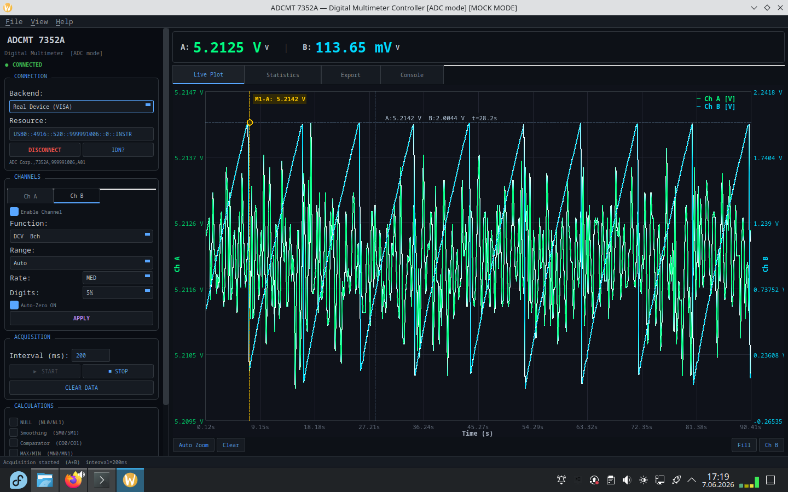

# ADCMT 7352A Digital Multimeter Controller

Dual-channel measurement GUI for the [ADCMT 7352A](https://www.adcmt.com/en/products/dmm/7352) 5.5-digit multimeter with
OpenGL plotting, independent per-channel settings, and real-time statistics/export.



The communication backend has been written based on the [ADCMT 7352A OPERATION
MANUAL](https://www.manualslib.com/manual/2242207/Adcmt-7352a.html).

The device is initially detected under Linux as `usbtmc`. I had to blacklist this kernel module from loading to work
with PyVISA.

```bash
cat /etc/modprobe.d/usbtmc-blacklist.conf

blacklist usbtmc
```

I also had to add a `udev` rule to enable userspace access to the USB device through the `dialout` group in which my
user is added. 

```bash
cat /etc/udev/rules.d/99-dmm.rules

SUBSYSTEM=="usb", ATTR{idVendor}=="1334", ATTR{idProduct}=="0208", MODE="0666", GROUP="dialout"
```

## Features

- **VISA backend/mock for testing** — USB via PyVISA (`--real`)
- **Dual-channel acquisition** — both A and B channels simultaneously
- **Dual Y-axis OpenGL plot** 
- **Per-channel independent** function, range, rate, digits, auto-zero, and enable
- **Real-time statistics** — min, max, avg, stddev, pk-pk, count per channel
- **CSV / TXT export** with optional timestamp
- **Console tab** — command entry with autocomplete and history
- **Dark / Light theme** toggle (persisted across sessions)

## Requirements

- Python 3.8+
- PyQt5
- NumPy
- PyOpenGL
- PyVISA - for real hardware, `pyvisa-py` (optional, USB without NI-VISA)


## Quick Start

```bash
# Mock mode (no hardware required) — default
python main.py

# Real hardware via USB
python main.py --real
```

Default VISA resource: `USB0::4916::520::999991006::0::INSTR`

### Command-Line Arguments

| Argument | Description |
|----------|-------------|
| `--mock` | Use mock backend (no hardware required) |
| `--real` | Use real VISA hardware |

If neither flag is given, mock mode is used.

## Architecture

```
gui/
├── commands/
│   ├── adc_commands.py   # ADC command registry (F1–F50, ranges, rates, etc.)
│   └── parser.py         # Single/dual response parser, output formatter
├── instruments/
│   ├── adcmt7352a_adc.py # Unified driver (VISA + mock)
│   ├── visa_backend.py   # Real PyVISA backend
│   └── mock_backend.py   # Simulated dual-channel instrument
├── core/
│   ├── config.py         # QSettings persistence
│   ├── theme.py          # Dynamic color scheme per theme
│   ├── worker.py         # Dual-channel acquisition worker (QThread)
│   └── logger.py         # Console log handler
├── ui/
│   ├── main_window.py    # Main window with 3-pane layout
│   ├── panels/           # (reserved for future panels)
│   └── tabs/
│       ├── stats_tab.py  # Real-time statistics
│       ├── export_tab.py # CSV/TXT logging
│       └── console_tab.py# Command console with autocomplete
├── plotting/
│   └── gl_plot.py        # Dual Y-axis OpenGL plot widget
├── resources/
│   ├── styles.qss        # Dark theme stylesheet
│   └── light.qss         # Light theme stylesheet
└── main.py               # Entry point
```

### Initialization Sequence (ADC Mode)

The device can use SCPI commands and special set of ADC Mode commands. Both are described in the documentation. Below is
an example of ADC commands used to initialize the device.

```
*RST   →  H1  →  DE0  →  SD1  →  TRS0  →  INIC1
```

| Step | Command | Purpose |
|------|---------|---------|
| 1 | `*RST` | Factory reset |
| 2 | `H1` | Output header ON |
| 3 | `DE0` | Second display OFF (single channel init) |
| 4 | `SD1` | Output first display only |
| 5 | `TRS0` | Trigger source = IMMEDIATE |
| 6 | `INIC1` | Continuous measurement ON |

For dual-channel the sequence adds `DE1` + `SD0` before acquisition.

## ADC Command Reference 

This section documents all ADC-mode commands. The instrument uses ADC Corporation's proprietary command set (selectable
via `LANG ADC` in the I/F menu).

**General rules:**

- Commands are ASCII, terminated with `\r\n`
- After a query command, wait ≥20 ms before reading (USB)
- `DSP1,<cmd>` applies to the first display (left, default = Ch A)
- `DSP2,<cmd>` applies to the second display (right, Ch B)
- Omitting the DSP prefix targets the currently selected display (Ch A by default)

### Measurement Function Selection

| Command | Function | Symbol | Unit | Ch A | Ch B |
|---------|----------|--------|------|------|------|
| `F1` | DC Voltage | DCV | V | ✓ | — |
| `F2` | AC Voltage | ACV | V | ✓ | — |
| `F3` | 2-Wire Resistance | 2WΩ | Ω | ✓ | — |
| `F5` | DC Current | DCI | A | ✓ | — |
| `F6` | AC Current | ACI | A | ✓ | — |
| `F7` | AC+DC Voltage | ADV | V | ✓ | — |
| `F8` | AC+DC Current | ADI | A | ✓ | — |
| `F12` | DC Voltage (Bch) | BDV | V | — | ✓ |
| `F13` | Diode | DOD | V | ✓ | — |
| `F20` | Low-Power 2WΩ | R2L | Ω | ✓ | — |
| `F22` | Continuity | RCT | Ω | ✓ | — |
| `F35` | DC Current (Bch) | BDI | A | — | ✓ |
| `F36` | AC Current (Bch) | BAI | A | — | ✓ |
| `F37` | AC+DC Current (Bch) | BCI | A | — | ✓ |
| `F40` | Temperature | TC_ | °C | ✓ | — |
| `F50` | Frequency | FRQ | Hz | ✓ | — |

**Examples:**
```
F1              # Set current display to DCV (Ach)
DSP1,F5         # Set display 1 to DCI (Ach)
DSP2,F12        # Set display 2 to DCV (Bch)
F?              # Query current function (reply: F01..F50)
```

**Function key list per channel:**

| Channel | Keys |
|---------|------|
| A | `F1`, `F2`, `F7`, `F3`, `F20`, `F5`, `F6`, `F8`, `F50`, `F13`, `F22`, `F40` |
| B | `F12`, `F35`, `F36`, `F37` |

### Range Selection

#### Ach Ranges

| Range Cmd | DCV | ACV/ADV | DCI | ACI/ADI | 2WΩ | LP-2WΩ | FREQ |
|-----------|-----|---------|-----|---------|-----|--------|------|
| `R0` | AUTO | AUTO | AUTO | AUTO | AUTO | AUTO | AUTO |
| `R1` | — | — | 2000 nA | — | — | — | — |
| `R2` | — | — | 20 µA | — | — | — | — |
| `R3` | 200 mV | 200 mV | 200 µA | 200 µA | 200 Ω | 200 Ω | (200 mV) |
| `R4` | 2 V | 2 V | 2 mA | 2 mA | 2 kΩ | 2 kΩ | (2 V) |
| `R5` | 20 V | 20 V | 20 mA | 20 mA | 20 kΩ | 20 kΩ | (20 V) |
| `R6` | 200 V | 200 V | 200 mA | 200 mA | 200 kΩ | 200 kΩ | (200 V) |
| `R7` | 1000 V | 700 V | 2000 mA | 2000 mA | 2 MΩ | 2 MΩ | (700 V) |
| `R8` | — | — | — | — | 20 MΩ | 20 MΩ | — |
| `R9` | — | — | — | — | 200 MΩ | — | — |

#### Bch Ranges

| Range Cmd | DCV-Bch (F12) | DCI-Bch (F35) | ACI-Bch (F36) | ACI+DC-Bch (F37) |
|-----------|----------------|----------------|----------------|-------------------|
| `R0` | AUTO | — | — | — |
| `R3` | 200 mV | — | — | — |
| `R4` | 2 V | — | — | — |
| `R5` | 20 V | — | — | — |
| `R6` | 200 V | — | — | — |
| `R8` | — | 10 A | 10 A | 10 A |

**Examples:**
```
R4              # Manual range 2 V (Ach DCV)
DSP2,R8         # Set Bch range to 10 A
RX              # Switch from AUTO to MANUAL range
R?              # Query range (reply: R0..R9)
```

### Sampling Rate

| Command | Rate |
|---------|------|
| `PR1` | FAST |
| `PR2` | MED |
| `PR3` | SLOW1 |
| `PR4` | SLOW2 (same as SLOW1 for frequency) |

```
PR2             # MED rate
PR?             # Query rate (reply: PR1..PR4)
```

### Display Digits

| Command | Digits |
|---------|--------|
| `RE3` | 3½ |
| `RE4` | 4½ |
| `RE5` | 5½ |

```
RE5             # 5½ digit display
RE?             # Query digits (reply: RE3..RE5)
```

### Auto-Zero

| Command | Mode |
|---------|------|
| `AZ0` | OFF |
| `AZ1` | ON |
| `AZ2` | ONCE (then reverts to OFF) |

```
AZ1             # Auto-zero ON
AZ?             # Query (reply: AZ0 or AZ1)
```

### Continuity Threshold & Temperature Sensor

| Command | Description |
|---------|-------------|
| `KOM<n>` | Continuity threshold constant, n = 1–1000 Ω (default: 10) |
| `KOM?` | Reply: `KOMdddd` |
| `TCR0` | K-type thermocouple |
| `TCR1` | T-type thermocouple |
| `TCR?` | Reply: `TCR0` or `TCR1` |

### Trigger System

| Command | Description |
|---------|-------------|
| `*TRG` | Generate trigger (BUS source) |
| `INI` | Exit IDLE state → trigger wait |
| `INIC0` | CONTINUOUS OFF |
| `INIC1` | CONTINUOUS ON |
| `ABO` | Abort measurement → IDLE |
| `TRS0` | Trigger source = IMMEDIATE |
| `TRS1` | Trigger source = MANUAL |
| `TRS2` | Trigger source = EXTERNAL |
| `TRS3` | Trigger source = BUS |
| `TRS?` | Reply: TRS0–TRS3 |
| `TRD<n>` | Trigger delay, n = 0–3600 s (default: 0). DSP2 valid when TDE1 |
| `TRD?` | Reply: `TRD±d.ddddE±dd` |
| `TDE0` | Individual trigger delay OFF |
| `TDE1` | Individual trigger delay ON |
| `TDE?` | Reply: TDE0/TDE1 |
| `TRN<n>` | Trigger count, n = 1–50000 (default: 1) |
| `TRN?` | Reply: `TRNddddd` |
| `SPN<n>` | Sampling count per trigger, n = 1–16000 (default: 1) |
| `SPN?` | Reply: `SPNddddd` |

**Typical free-run acquisition:**
```
TRS0            # IMMEDIATE trigger
INIC1           # CONTINUOUS ON
```

**Single-shot with BUS trigger:**
```
TRS3            # BUS trigger
SPN10           # 10 samples per trigger
INIC1           # CONTINUOUS ON
*TRG            # Trigger
```

### Measurement Data Memory

| Command | Description |
|---------|-------------|
| `ST0` | Memory store OFF |
| `ST1` | Memory store ON |
| `ST?` | Reply: ST0/ST1 |
| `IRD<n>,<m>` | Set recall range. Single: 0–19999, Dual: 0–9999 |
| `IRO?` | Read stored data (see §6.6.2 format) |
| `IRPO?` | Read stored data count. Reply: `IRPOddddd` |
| `IRNO?` | Read stored data range. Reply: `IRNO ddddd, ddddd` |
| `ICL` | Clear measurement data memory |
| `MD?` | Measured data output request (RS-232 only) |

### Display & Output Control

| Command | Description |
|---------|-------------|
| `DE0` | Second display OFF |
| `DE1` | Second display ON (dual mode) |
| `DE?` | Reply: DE0/DE1 |
| `DSP1` | Select first display (as target for subsequent commands) |
| `DSP2` | Select second display |
| `SD0` | Output both displays (comma-separated) |
| `SD1` | Output first display only |
| `SD2` | Output second display only |
| `SD?` | Reply: SD0–SD2 |
| `DS0` | Measurement data display OFF |
| `DS1` | Measurement data display ON |
| `DS?` | Reply: DS0/DS1 |
| `H0` | Header OFF |
| `H1` | Header ON |
| `H?` | Reply: H0/H1 |
| `ODE<n>` | Output data element (0 = none, bitmask for calc outputs). n: 0–7 |
| `ODE?` | Reply: `ODEddd` |
| `DL0` | Block delimiter = CR/LF+EOI |
| `DL1` | Block delimiter = LF |
| `DL2` | Block delimiter = EOI |
| `DL?` | Reply: DL0–DL2 |
| `LF?` | Power line frequency. Reply: `LF0` (50 Hz) or `LF1` (60 Hz) |

### Buzzer & SRQ

| Command | Description |
|---------|-------------|
| `BZ0` | Buzzer OFF |
| `BZ1` | Buzzer ON (default) |
| `BZ2`–`BZ4` | On specific key events (front panel only) |
| `BZ?` | Reply: BZ0/BZ1 |
| `BP0` | Comparator result buzzer OFF |
| `BP1` | Buzzer on comparator FAIL |
| `BP2` | Buzzer on comparator PASS |
| `BP?` | Reply: BP0–BP2 |
| `S0` | SRQ transmission OFF |
| `S1` | SRQ transmission ON |
| `S?` | Reply: S0/S1 |

## Calculation Commands 

### NULL Calculation

| Command | Description |
|---------|-------------|
| `NL0` | NULL calculation OFF |
| `NL1` | NULL calculation ON |
| `NL?` | Reply: NL0/NL1 |
| `KNL<n>` | NULL constant, n = ±999999E+6, resolution 0.00001E-9 |
| `KNL?` | Reply: `KNL±d.dddddE±dd` |

### Smoothing Calculation

| Command | Description |
|---------|-------------|
| `SM0` | Smoothing OFF |
| `SM1` | Smoothing ON |
| `SM?` | Reply: SM0/SM1 |
| `TI<n>` | Smoothing count, n = 2–100 (default: 10) |
| `TI?` | Reply: `TIddd` |

### Scaling Calculation

| Command | Description |
|---------|-------------|
| `SC0` | Scaling OFF |
| `SC1` | Scaling ON |
| `SC?` | Reply: SC0/SC1 |
| `KA<n>` | Constant A (cannot be zero), n = ±999999E+6 (default: 1) |
| `KB<n>` | Constant B, n = ±999999E+6 (default: 0) |
| `KC<n>` | Constant C, n = ±999999E+6 (default: 1) |
| `KAM` | Set constant A = current measurement value |
| `KBM` | Set constant B = current measurement value |
| `KCM` | Set constant C = current measurement value |
| `KA?` | Reply: `KA±d.dddddE±dd` |
| `KB?` | Reply: `KB±d.dddddE±dd` |
| `KC?` | Reply: `KC±d.dddddE±dd` |

### dB/dBm Calculation

| Command | Description |
|---------|-------------|
| `DB0` | dB/dBm calculation OFF |
| `DB1` | dB calculation ON (voltage/current functions only) |
| `DB2` | dBm calculation ON (voltage functions only) |
| `DB?` | Reply: DB0–DB2 |
| `KD<n>` | Constant D, n = 0.00001E-9 to 999999E+6 (default: 1) |
| `KDM` | Set constant D = current measurement value |
| `KD?` | Reply: `KD±d.dddddE±dd` |

### MAX/MIN Calculation

| Command | Description |
|---------|-------------|
| `MN0` | MAX/MIN calculation OFF |
| `MN1` | MAX/MIN calculation ON |
| `MN?` | Reply: MN0/MN1 |
| `MAX?` | Read MAX value. Reply: `M ±d.dddddE±dd` |
| `MIN?` | Read MIN value. Reply: `I ±d.dddddE±dd` |
| `AVE?` | Read AVE value. Reply: `A ±d.dddddE±dd` |
| `AVN?` | Read measurement count. Reply: `AVN±d.dddddE±dd` |

### Comparator Calculation

| Command | Description |
|---------|-------------|
| `CO0` | Comparator OFF |
| `CO1` | Comparator ON (also sets single measurement) |
| `CO?` | Reply: CO0/CO1 |
| `HI<n>` | HIGH limit constant, n = ±999999E+6 (default: 0) |
| `LO<n>` | LOW limit constant, n = ±999999E+6 (default: 0) |
| `HIM` | Set HI = current measurement value |
| `LOM` | Set LO = current measurement value |
| `HI?` | Reply: `HI±d.dddddE±dd` |
| `LO?` | Reply: `LO±d.dddddE±dd` |
| `LOP0` | LOW not specified as PASS condition |
| `LOP1` | LOW specified as PASS condition |
| `MIP0` | GO not specified as PASS condition |
| `MIP1` | GO specified as PASS condition |
| `HIP0` | HI not specified as PASS condition |
| `HIP1` | HI specified as PASS condition |

### Statistical Calculation (Memory-based)

| Command | Description |
|---------|-------------|
| `SIRD<n>,<m>` | Set statistical range & compute. Single: 0–19999, Dual: 0–9999 |
| `SIRD?` | Read range. Reply: `SIRDdddd,dddd` |
| `SCNT?` | Sample count. Reply: `SCNT±d.dddddE±dd` |
| `SMAX?` | Maximum value in memory. Reply: `SMAX±d.dddddE±dd` |
| `SMIN?` | Minimum value in memory. Reply: `SMIN±d.dddddE±dd` |
| `SAVE?` | Average value in memory. Reply: `SAVE±d.dddddE±dd` |
| `SSIG?` | Standard deviation. Reply: `SSIG±d.dddddE±dd` (or +9.99999E+11 if ≤1 sample) |
| `SPTP?` | Peak-to-peak (MAX-MIN). Reply: `SPTP±d.dddddE±dd` |

### Calculation Between 2 Measurements (Dual Math)

| Command | Description |
|---------|-------------|
| `MCL0` | OFF |
| `MCL1` | Display 1 + Display 2 |
| `MCL2` | Display 1 − Display 2 |
| `MCL3` | Display 1 × Display 2 |
| `MCL4` | Display 1 ÷ Display 2 |
| `MCL?` | Reply: `MCLd` |

Valid only when 2nd display is ON (DE1).

## System Commands

### Device Control

| Command | Description |
|---------|-------------|
| `*RST` | Parameter initialization (factory defaults) |
| `*CLS` | Clear status registers |
| `*IDN?` | Query identity. Reply: `ADC Corp.,7352x,<serial>,<rev>` |
| `*OPC` | Set OPC bit after all operations complete |
| `*OPC?` | Reply: `1` after all operations complete |
| `*WAI` | Wait for completion (GPIB only) |
| `*TST?` | Self-test. Reply: `0` = pass, `1` = fail |
| `*TRG` | Bus trigger |

### Status Registers

| Command | Description |
|---------|-------------|
| `*STB?` | Read Status Byte Register. Reply: `ddd` |
| `*SRE<n>` | Set Service Request Enable Register, n = 0–255 (bit6 cannot set) |
| `*SRE?` | Reply: `ddd` |
| `*ESR?` | Read Standard Event Status Register. Reply: `ddd` |
| `*ESE<n>` | Set Standard Event Status Enable Register, n = 0–255 |
| `*ESE?` | Reply: `ddd` |
| `MSR?` | Read Measurement Event Register (MER). Reply: `ddddd` |
| `MSE<n>` | Set Measurement Event Enable Register (MEER), n = 0–65535 |
| `MSE?` | Reply: `ddddd` |
| `QSR?` | Read Questionable Event Register (QER). Reply: `ddddd` |
| `QSE<n>` | Set Questionable Event Enable Register (QEER), n = 0–65535 |
| `QSE?` | Reply: `ddddd` |
| `OSR?` | Read Operation Event Register (OER). Reply: `ddddd` |
| `OSE<n>` | Set Operation Event Enable Register (OEER), n = 0–65535 |
| `OSE?` | Reply: `ddddd` |
| `*PSC<n>` | Power-on status clear flag. n ≠ 0 → clear SRER/SESER on power-up |
| `*PSC?` | Reply: `0` or `1` |
| `*OPT?` | Option info. Reply: `0` = no option |
| `ERR?` | Read error queue (FIFO, up to 20). Reply: `±ddd,"<message>"` |

#### Status Register Structure (PDF §6.6.5)

```
STB (Status Byte Register):
  bit0: MSB (Measurement Summary)
  bit2: EAV (Error Available)
  bit3: QSB (Questionable Summary)
  bit4: MAV (Message Available)
  bit5: ESB (Standard Event Status)
  bit6: MSS/RQS (Master Summary / Request Service)
  bit7: OSB (Operation Summary)

ESR (Standard Event Status Register):
  bit0: OPC (Operation Complete)
  bit3: DDE (Device Dependent Error)
  bit4: EXE (Execution Error)
  bit5: CME (Command Error)
  bit7: PON (Power On)

MER (Measurement Event Register):
  bit0: FAIL (comparator FAIL)
  bit1: PASS (comparator PASS)
  bit8: EOM (End of Measure)
  bit9: EOS (End of Store)
  bit10: SM (Smoothing Complete)
  bit11: STAT (Statistics Complete)

QER (Questionable Event Register):
  bit0: Voltage Overload
  bit1: Current Overload
  bit4: Temperature Overload
  bit5: Frequency Overload
  bit8: Calibration Summary
  bit9: Ohms Overload
  bit12: Alarm

OER (Operation Event Register):
  bit5: Waiting for TRIG
  bit9: Idle
```

### Save/Recall

| Command | Description |
|---------|-------------|
| `*SAV0`–`*SAV3` | Save settings to non-volatile memory area 0–3 |
| `*RCL0`–`*RCL3` | Recall settings from area 0–3 |
| `SINI` | Reset all saved areas to factory defaults |
| `RINI` | Load factory defaults as current settings |

### Calibration

| Command | Description |
|---------|-------------|
| `CAL0` | Calibration mode OFF (writes calibration factor on exit) |
| `CAL1` | Calibration mode ON |
| `CAL?` | Reply: CAL0/CAL1 |
| `XOUT` | Cancel calibration mode (no write) |
| `PC<n>` | Enter STD value as displayed count, n = 0–±999999 |
| `XDT<n>` | Enter STD value as displayed value |
| `CMNT"<str>"` | Store calibration info string, up to 50 chars |
| `CMNT?` | Reply: `CMNT"xxxxxxx"` |

### Function Inhibit

| Command | Description |
|---------|-------------|
| `INH<n>,<m>` | Set function inhibition. n = function number (1=DCV..50=FREQ), m = 0 (disable) / 1 (enable) |
| `INH?<n>` | Query inhibition state for function n. Reply: 0 (disabled) / 1 (enabled) |

## Output Data Format 

### Single Display (SD1 / SD2)

With header (H1):
```
DCV_ +3.29860E+00\r\n
```

Without header (H0):
```
+3.29860E+00\r\n
```

### Dual Display (SD0)

With header:
```
DCV_ +3.29860E+00, BDI_ +1.02400E-01\r\n
```

Without header:
```
+3.29860E+00,+1.02400E-01\r\n
```

### Header Codes

| Header | Function |
|--------|----------|
| `DCV` | DC Voltage (Ach) |
| `ACV` | AC Voltage (Ach) |
| `ADV` | AC+DC Voltage (Ach) |
| `R2W` | 2-Wire Resistance (Ach) |
| `DCI` | DC Current (Ach) |
| `ACI` | AC Current (Ach) |
| `ADI` | AC+DC Current (Ach) |
| `DOD` | Diode (Ach) |
| `R2L` | Low-Power 2WΩ (Ach) |
| `RCT` | Continuity (Ach) |
| `FRQ` | Frequency (Ach) |
| `TC_` | Temperature |
| `BDV` | DC Voltage (Bch) |
| `BDI` | DC Current (Bch) |
| `BAI` | AC Current (Bch) |
| `BCI` | AC+DC Current (Bch) |

### Sub-Header Codes

| Code | Meaning | Priority |
|------|---------|----------|
| `_` | Normal | 8 (lowest) |
| `O` | Overload | 1 |
| `E` | Calculation error | 2 |
| `H` | Comparator HI | 3 |
| `P` | Comparator PASS (GO) | 3 |
| `L` | Comparator LOW | 3 |
| `D` | CALC2 (between 2 meas.) | 3 |
| `M` | MAX data | 4 |
| `I` | MIN data | 4 |
| `A` | AVE data | 4 |
| `B` | dB data | 5 |
| `W` | dBm data | 6 |
| `S` | Scaling data | 7 |
| `N` | NULL data | 8 |

### Overload & Error Values

| Value | Meaning |
|-------|---------|
| `±9.99999E+37` | Overload (OL) |
| `±9.99999E+36` | Scaling / CALC2 overflow |
| `±9.99999E+35` | dB/dBm error or zero-division in CALC2 |

The overload threshold (checked by the parser) is **9.9e+36** — any value ≥ this is flagged as overload.

### Per-Range Mantissa Formats (Ach DCV example)

| Range | Format |
|-------|--------|
| 200 mV | `±ddd.dddE-03` |
| 2 V | `±dddd.ddE-03` |
| 20 V | `±dd.ddddE+00` |
| 200 V | `±ddd.dddE+00` |
| 1000 V | `±dddd.ddE+00` |

Full per-range format tables are in the manual (§6.6.2, pp. 6-16–6-17).

## Dual Display Operation 

The 7352A has two independent AD converters — measurement on both channels is truly simultaneous.

### Enabling Dual Display

```
DE1             # Enable second display (Bch)
DSP1,F1         # Ch A → DCV
DSP2,F12        # Ch B → DCV
SD0             # Output comma-separated dual data
```

### Independent Settings

Each channel has its own function, range, rate, digits, and auto-zero — set using the `DSP1,`/`DSP2,` prefix:

```
DSP1,F1         # Ch A = DCV
DSP1,R4         # Ch A = 2 V range
DSP1,PR1        # Ch A = FAST
DSP1,RE5        # Ch A = 5½ digits
DSP1,AZ1        # Ch A = auto-zero ON

DSP2,F35        # Ch B = DCI (10 A)
DSP2,PR2        # Ch B = MED
DSP2,RE4        # Ch B = 4½ digits
DSP2,AZ0        # Ch B = auto-zero OFF
```

### Reading Dual Data

```python
# Via SD0 (both channels in one read):
raw = instrument.read()        # "BDV_ +3.29860E+00, DCV_ +1.02400E-01"
val_a, val_b = parse_dual_response(raw)

# Or single-channel reads:
instrument.write("DSP1")       # Select Ch A
raw_a = instrument.read()

instrument.write("DSP2")       # Select Ch B
raw_b = instrument.read()
```

## SCPI Command Reference Overview 

The 7352A also supports SCPI commands (select `LANG SCPI` in the I/F menu). The GUI uses ADC
mode only, but the console tab works with SCPI commands too. Common mappings:

**Warining**: I haven't tested the SCPI interface.

| ADC Command | SCPI Equivalent |
|-------------|-----------------|
| `F1` | `:SENS:FUNC "VOLT:DC",(@1)` |
| `F2` | `:SENS:FUNC "VOLT:AC",(@1)` |
| `F12` | `:SENS:FUNC "VOLT:BDC",(@1)` |
| `R4` | `:SENS:VOLT:DC:RANGE 1.99999,(@1)` |
| `PR2` | `:SENS:VOLT:DC:SRATE MED` |
| `RE5` | `:SENS:VOLT:DC:DIGIT 5,(@1)` |
| `AZ1` | `:SENS:ZERO:AUTO ON` |
| `DE1` | `:DISP:WIND2:STAT ON` |
| `SD0` | `:FORM:READ:MCH BOTH` |
| `SD1` | `:FORM:READ:MCH 1` |
| `TRS0` | `:TRIG:SOUR IMM` |
| `TRS3` | `:TRIG:SOUR BUS` |
| `*IDN?` | `*IDN?` |
| `*RST` | `*RST` |
| `*TRG` | `*TRG` |
| `ERR?` | `:SYST:ERR?` |

SCPI commands use `(@1)` for first display and `(@2)` for second display, e.g.:
```
:SENS:FUNC "CURR:BDC",(@2)    # Bch DCI
:SENS:CURR:BDC:RANGE 9.99999,(@2)  # 10 A range
```

## GUI Features

### CHANNELS Tabbed Panel

- **Ch A / Ch B tabs** in a single collapsible group
- Enable checkbox per channel (Ch B disabled by default)
- Function combo (populated with channel-appropriate keys)
- Range combo (auto-populated based on selected function)
- Rate, Digits, Auto-Zero controls
- [Apply] button sends settings to the instrument

### Plot Tab

- Dual Y-axis OpenGL plot using `EnhancedGLPlot` / `_GLPlotWidget`
- **Left Y-axis** (green): Channel A
- **Right Y-axis** (cyan): Channel B
- Shared time axis with configurable buffer (default 600 points)
- Crosshair showing both channel values at cursor position
- Markers: M1 (left click on Ch A), M2 (right click on Ch B), with delta readout
- Middle-mouse drag to pan; scroll to zoom
- Toolbar: Auto Zoom, Clear, Fill toggle, Ch B toggle
- Data point count overlay at top

### Statistics Tab

- Per-channel staticstics computed locally:
  - Count, Min, Max, Avg, StdDev, Pk-Pk
- Color-coded labels (green = Ch A, cyan = Ch B)
- [Reset] button clears accumulated data

### Export Tab

- CSV or TXT format selection
- Timestamp column toggle
- [Start Export] creates a date-stamped file in the working directory
- [Stop Export] closes the file
- Appends each acquired reading row by row

### Console Tab

- Command entry field with **autocomplete** for all ADC commands
- Command history via **Up/Down** arrow keys
- [Send] button + Enter key to transmit
- [Clear] button to clear the console log
- Response and status display in the log area
- Supports any ADC or SCPI command — useful for testing and debugging

### Themes

- **View → Dark Theme** toggle (default: dark)
- Persisted across sessions via QSettings
- Light theme: light background, dark text, adjusted plot colors
- Both themes use CSS-style QSS + dynamic `ThemeColors` for live elements

### Configuration Persistence

The following settings are saved/restored via QSettings:

- Window geometry and state (position, size, maximized)
- Channel A/B enabled state
- Last function for Ch A and Ch B
- Read interval
- Dark theme preference


## Real-Device Validation

### Instrument Behavior Discoveries

The following behaviors were confirmed via hardware testing with an ADCMT 7352A (firmware A01):

**Function query format**: `F?` returns zero-padded two-digit function codes for single-digit functions (F01, F02, F03, F05). F50 returns as-is. The GUI parser handles both formats; the comparison is normalized in the test suite using `_fk_eq()`.

**Per-display RE setting**: `RE` (digits) is stored per-display (`DSP1`/`DSP2`), while `PR` (rate) is shared globally. Setting `DSP2,RE4` does not change the value returned by a bare `RE?` query (which reflects display 1). To query display 2's digits, use `DSP2,RE?`. The GUI's per-channel apply methods (`apply_settings_ch_a/b`) correctly use the DSP prefix for writes.

**Statistics require MN1**: The MAX/MIN calculation (`MN1`) must be enabled before `AVN?`, `MAX?`, `MIN?`, and `AVE?` accumulate readings. After `*RST`, `MN0` is the default; stats queries return zero/placeholder values until `MN1` is set.

**SD2 for Ch B only**: Reading channel B in single-display mode requires `SD2` output mode, not `SD1` + `read_channel("B")`. The worker was fixed to use `enable_dual_display(False) + set_output_mode("SECOND")` when only Ch B is enabled, replacing the previous `read_channel` approach which returned display 1 data regardless of the DSP2 prefix.

**Read interval**: With `INIC1` continuous mode and SD1, the instrument produces data faster than the acquisition loop's 200ms interval when in FAST rate. The timing test confirmed intervals averaging ~223ms (target 200ms, ±50% tolerance), dominated by Python's `time.sleep` accuracy and USB bulk transfer latency.

### Worker Acquisition Modes

| Mode | Channels | DE | SD | Read method |
|------|----------|----|----|-------------|
| BOTH | A + B | DE1 | SD0 | `read_dual()` |
| FIRST | A only | DE0 | SD1 | `read()` |
| SECOND | B only | DE0 | SD2 | `read()` |

### Test Results Summary

All 22 tests pass on hardware. The suite covers: connection, init, all per-channel settings (function, range, rate, digits, auto-zero via DSP1/DSP2 prefixes), calculations (NL, SM+TI, SC, DB, MN, CO+HI/LO), all 10 read stats queries (including SCNT/SMAX/SMIN/SAVE/SSIG/SPTP), single/dual/worker acquisition sequences, continuous free-run, interval timing, error queue, status registers, and cleanup.


# Disclaimer

I used LLMs extensively during the development process. Tests have been conducted using a real device, but I hold no
responsibility for the program outcomes. The code is free to reuse. 
